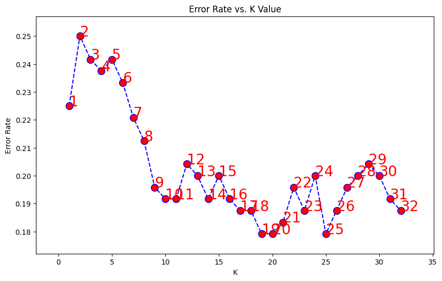
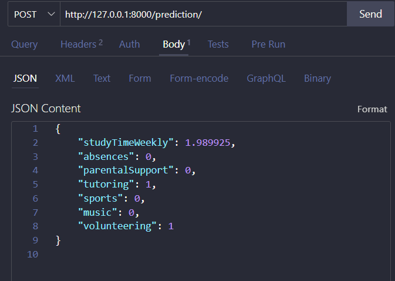
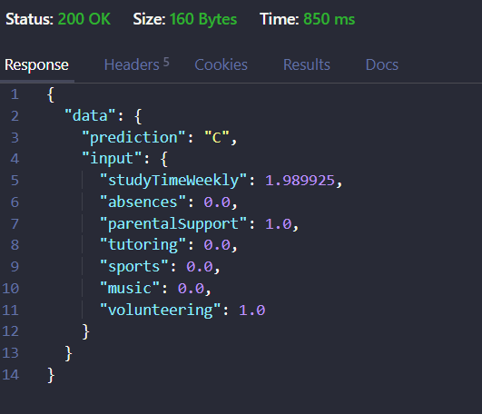

# Classification for student performance

  

## Tools

  
  
  
  

  

## My Objective

- Create and learning data with supervised machine learning
- Comparing with 2 supervised machine learning by accuracy score
- Save and deploy best machine learning with highest accuracy score and good classification report.
- Make a API with FastAPI.

### [link data](https://www.kaggle.com/datasets/rabieelkharoua/students-performance-dataset)

## Feature and target variable

### Features

- StudyTimeWeekly
- Absences
- Tutoring
- ParentalSupport
- Sports
- Music
- Volunteering

### Target variable in this data is GPA

- GradeClass: Classification of students' grades based on GPA:
- 0: 'A' (GPA >= 3.5)
- 1: 'B' (3.0 <= GPA < 3.5)
- 2: 'C' (2.5 <= GPA < 3.0)
- 3: 'D' (2.0 <= GPA < 2.5)
- 4: 'F' (GPA < 2.0)

## Machine learning

 Comparing machine learning and save best model by accuracy score

### K-nearest neighbor

#### Feature Engineering

Using Standard scaler for normalize StudyTime Weekly cause best case to normalize feature when the feature not a one hot encoding (bias variance)  

#### Modelling

1. Using Hyperparameter Randomsearch to find best parameter and fiting with 5 cross validation and get best param:
   <pre> 'p': 2, 
   'n_neighbors': 38,
   'metric': 'manhattan',    
   'algorithm': 'brute' </pre>

   With these parameters, the accuracy score obtained with a train split test of 10% total data is:

1. Using hyperparameter params but not use k-value, using elbow method
   
   according to this image using k-value 25, so fitting and predict With these parameters, the accuracy score obtained with a train split test of 10% total data is 82%.

## Deployment

### FastAPI

    with basemodel (same as a interface in TypeScript) for feature input

#### Result

# TO BE CONTINUE
<pre>
* DO create database like crud
* adding comparion  why choose dec tree
</pre>
